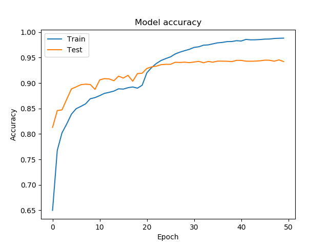
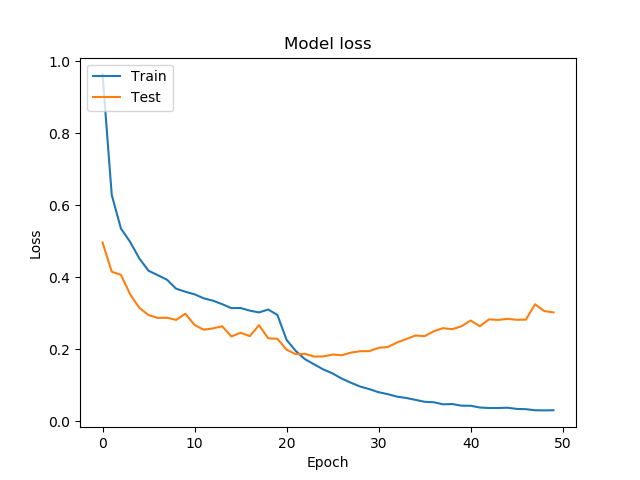
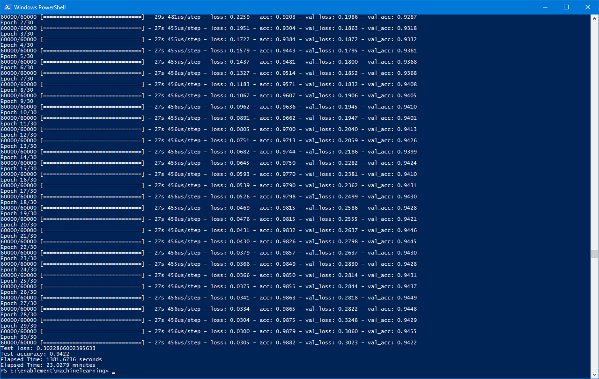

# Fashion MNIST

[Fashion MNIST](https://github.com/zalandoresearch/fashion-mnist) is a good testbench for trying out different NN configurations and hyper parameters. The current setup consistenty achieves 94% test accuracy and 98% training accuracy.

### fashion_trainer.py Model Configuration ###
_________________________________________________________________
Layer (type)                 Output Shape              Param #
=================================================================
conv2d (Conv2D)              (None, 27, 27, 196)       980
_________________________________________________________________
conv2d_1 (Conv2D)            (None, 26, 26, 256)       200960
_________________________________________________________________
max_pooling2d (MaxPooling2D) (None, 13, 13, 256)       0
_________________________________________________________________
conv2d_2 (Conv2D)            (None, 13, 13, 256)       65792
_________________________________________________________________
conv2d_3 (Conv2D)            (None, 12, 12, 512)       524800
_________________________________________________________________
dropout (Dropout)            (None, 12, 12, 512)       0
_________________________________________________________________
flatten (Flatten)            (None, 73728)             0
_________________________________________________________________
dense (Dense)                (None, 128)               9437312
_________________________________________________________________
dropout_1 (Dropout)          (None, 128)               0
_________________________________________________________________
dense_1 (Dense)              (None, 10)                1290
=================================================================
Total params: 10,231,134
Trainable params: 10,231,134
Non-trainable params: 0
_________________________________________________________________
None

